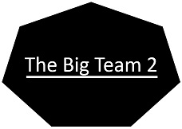

  

   

Projeto para o 6° Semestre de Banco de Dados da FATEC - São José dos Campos.

> 💬 **Desafio (Problema)**
>
> Precisamos de uma ferramenta informatizada para centralizar a avaliação dos critérios do PACER (Proatividade, Autonomia, Colaboração e Entrega de Resultados).
>
> 🚩 **Requisitos apresentados para os alunos**
> <strong>Requisitos Funcionais:</strong>
> - CRUD de Alunos e Equipes
> - CRUD de Professores
> - CRUD de Critérios de Avaliação
> - Abertura/Fechamento de Avaliação
> - Lançamento de notas
> - Relatórios

> <strong>Requisitos Não Funcionais:</strong>
> - Aderência a pelo menos 1 ponto da LGPD
> - Web

---

> 💬 **Desafio (Solução)**
>
> Um <strong>projeto de avaliação dos critérios do PACER <strong>, onde é possível:
> - gerar avaliação entre os membros da equipe.
> - professor lançar nota.
> - professor analisar e gerar relatórios.
>

---

## Tecnologias utilizadas

- Vue
- Python
- Flask
- Adminlte
- Bootstrap
- MariaDB
- Jira

---

## Banco de dados
https://github.com/TheBigTeam2/PACER_DB

## Backend
https://github.com/TheBigTeam2/PACER_BACKEND

## Frontend
https://github.com/TheBigTeam2/PACER_FRONTEND

---
## Sprints

### Sprint 1

- Criação do arquivo Mock.CSV.
- Levantamento de dados do Banco.
- Função de atribuição de Notas por Aluno.
- Criação da Tabela Professor.
- Criação da Tabela Aluno.
- Criação da Tabela Disciplina.
- Criação da Tabela Equipe.
- Criação da Tabela Avaliação.
- Criação da Tabela Nota.
- Criação da Tabela Projeto.
- Função de exibição de Nota Individual.
- Função de abertura de avaliação.

### Sprint 2

- A definir.

### Sprint 3

- A definir.

### Sprint 4

- A definir.

## Membros da Equipe ✨

Equipe 2:

<table>
  <tr>
    <td align="center"><a href="https://github.com/FelipeNicolettiRMario/"> <b>Felipe Nicoletti</b></a></td>
    <td align="center"><a href="https://github.com/giraudgabriel"> <b>Gabriel Giraud</b></a></td>
    <td align="center"><a href="https://github.com/jujalu/"> <b>Juliana Costa</b></a></td>
    <td align="center"><a href="https://github.com/Lucas-Povinske/"> <b>Lucas Povinske</b></a></td>
    <td align="center"><a href="https://github.com/cMatheusBRibeiro/"> <b>Matheus Ribeiro</b></a></td>
    <td align="center"><a href="https://github.com/rodrigocr16/"> <b>Rodrigo Reis</b></a></td>
  </tr>
</table>

[TheBigTeam2](https://github.com/TheBigTeam2/)
